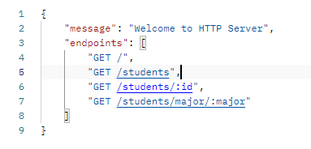
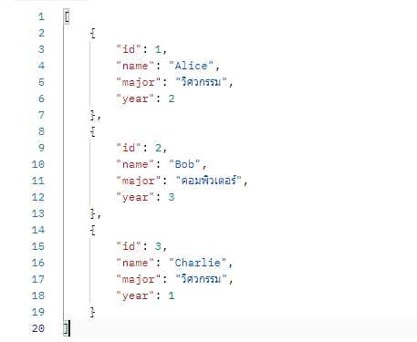
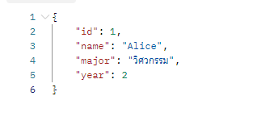
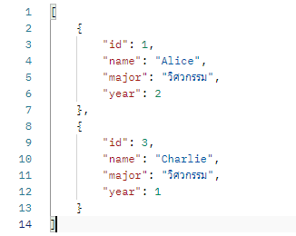
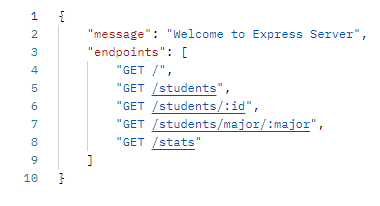
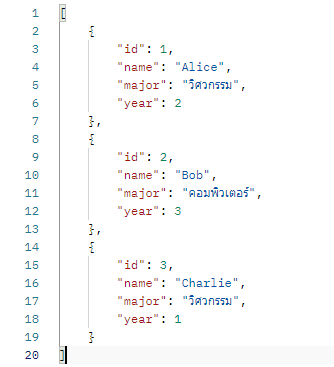
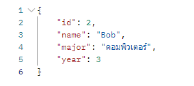
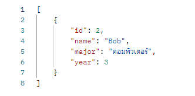
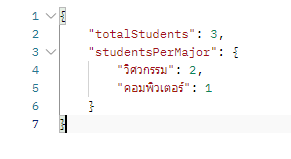

Student Data Service 🎓 – Node.js API Comparison
โปรเจกต์นี้แสดงการพัฒนาบริการ API เพื่อจัดการข้อมูลนักเรียน โดยใช้เทคนิคการสร้างเว็บเซิร์ฟเวอร์ที่ต่างกัน 2 รูปแบบใน Node.js: Native HTTP และ Express

ไฟล์และเทคโนโลยีที่ใช้ 🛠️
ไฟล์	เทคโนโลยีหลัก	บทบาทและลักษณะเฉพาะ
http-server.js	Node.js HTTP Core	สร้างเซิร์ฟเวอร์ด้วยโมดูลพื้นฐานของ Node.js โดยการจัดการ Routing (เส้นทาง) และ Request/Response จะทำด้วยตัวเองทั้งหมด
express-server.js	Express Framework	ใช้เฟรมเวิร์กยอดนิยม Express ช่วยให้การสร้าง Routing และการจัดการ Middleware ทำได้ง่ายและรวดเร็วกว่ามาก

ส่งออกไปยังชีต
การเตรียมพร้อม: ต้องติดตั้ง Express ก่อนเริ่มใช้งาน: npm install express

วิธีเริ่มต้นบริการ (Service Startup) 🚀
ในการทดสอบ คุณจำเป็นต้องรันเซิร์ฟเวอร์แต่ละตัวแยกกัน:

Server	คำสั่งรัน	พอร์ตที่ทำงาน
HTTP Server	node http-server.js	3000
Express Server	node express-server.js	3001

ส่งออกไปยังชีต
การตรวจสอบและทดสอบ Endpoint (Using cURL/Postman)
คุณสามารถใช้เครื่องมืออย่าง cURL ใน Terminal หรือโปรแกรม Postman/Insomnia เพื่อส่งคำขอ (GET Requests) ไปยังแต่ละเซิร์ฟเวอร์:

🌐 Test Set A: HTTP Core Server (Port 3000)
คำสั่งทดสอบ	Endpoint Path	วัตถุประสงค์ของ API
curl http://localhost:3000/	/ (Root)	ตรวจสอบสถานะการทำงาน (Health Check)

curl http://localhost:3000/students	/students	ดึงข้อมูล นักเรียนทั้งหมด

curl http://localhost:3000/students/1	/students/:id	ดึงข้อมูลนักเรียน เฉพาะรหัส 1

curl http://localhost:3000/students/major/วิศวกรรม	/students/major/:major	ดึงข้อมูลตาม สาขา "วิศวกรรม"

ส่งออกไปยังชีต
💡 Test Set B: Express Framework Server (Port 3001)
คำสั่งทดสอบ	Endpoint Path	วัตถุประสงค์ของ API
curl http://localhost:3001/	/ (Root)	ตรวจสอบสถานะการทำงาน (Health Check)

curl http://localhost:3001/students	/students	ดึงข้อมูล นักเรียนทั้งหมด

curl http://localhost:3001/students/2	/students/:id	ดึงข้อมูลนักเรียน เฉพาะรหัส 2

curl http://localhost:3001/students/major/บริหารธุรกิจ	/students/major/:major	ดึงข้อมูลตาม สาขา "คอมพิวเตอร์"

curl http://localhost:3001/stats	/stats	ดึง ข้อมูลสถิติ หรือสรุปของนักเรียน

