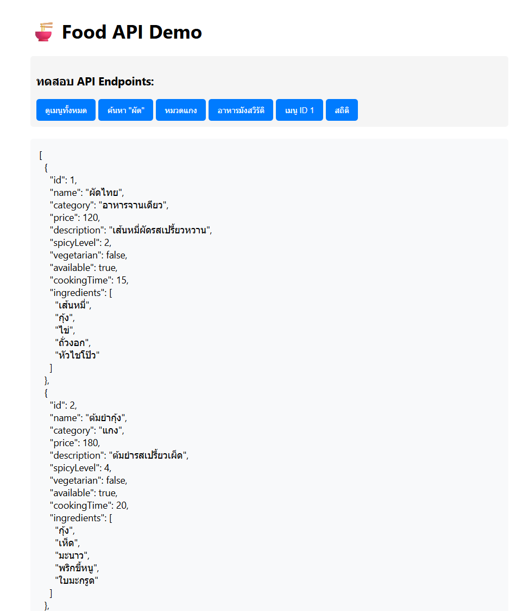
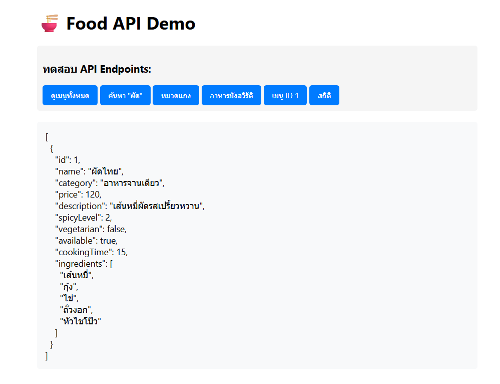
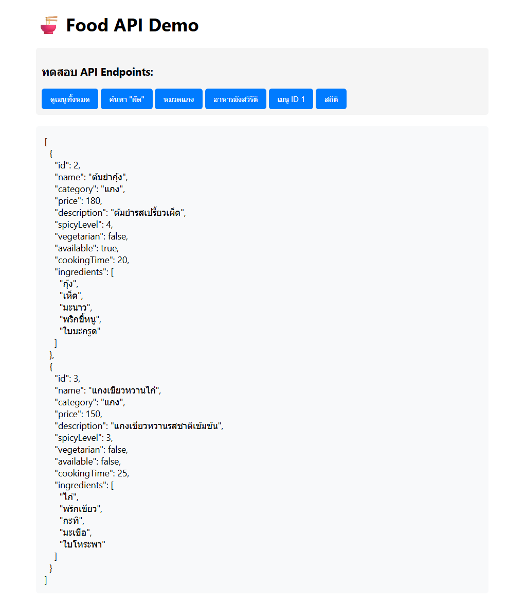
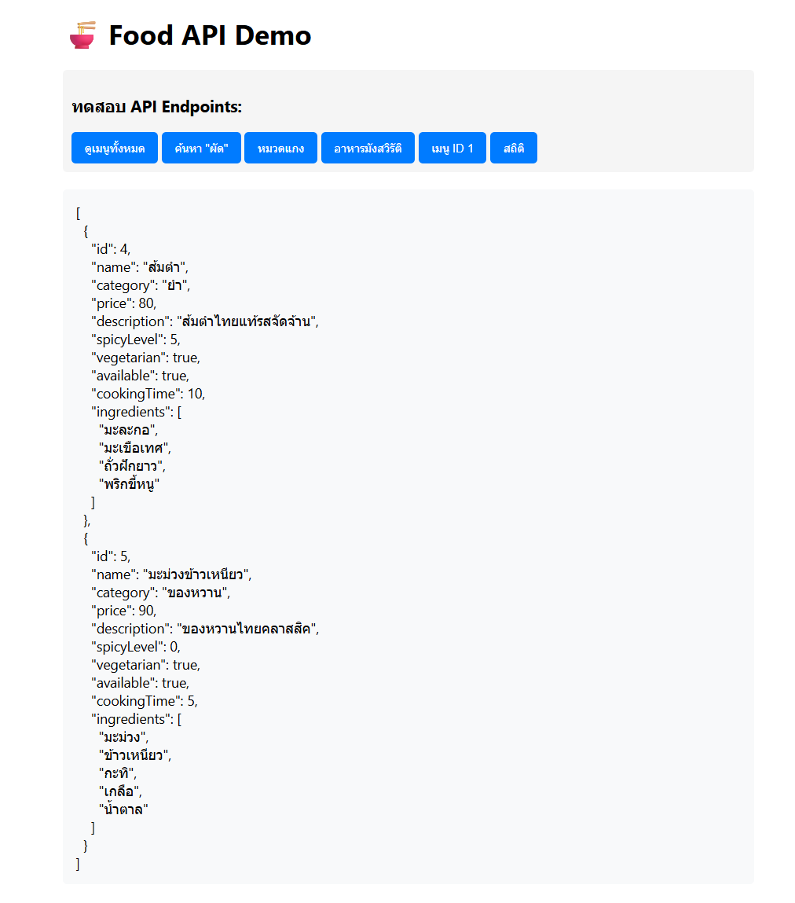
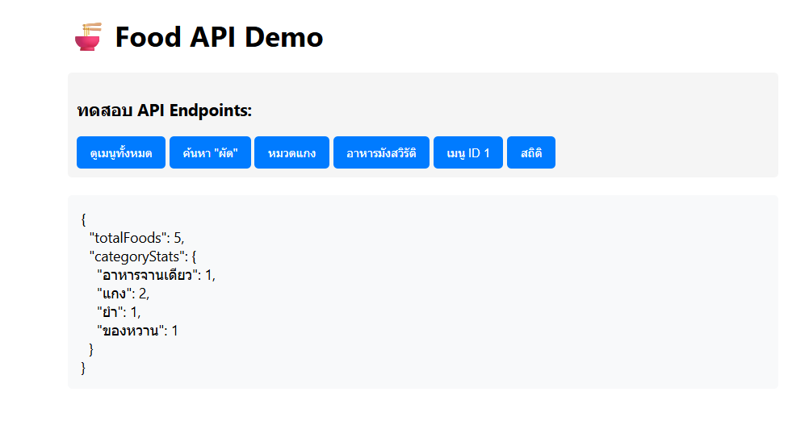

🍲 ระบบจัดการเมนูอาหาร (Thai Food API)
เอกสารประกอบการใช้งานสำหรับ Lab 4.2: การพัฒนา Backend ด้วย Node.js และ Express

⚙️ การเริ่มต้นใช้งาน
เพื่อให้เซิร์ฟเวอร์ Express ทำงาน โปรดทำตามขั้นตอนการติดตั้งด้านล่างนี้:

# ติดตั้ง Dependencies ทั้งหมดที่ระบุใน package.json
npm install
# รันเซิร์ฟเวอร์ในโหมดพัฒนา (Development Mode)
npm run dev

เซิร์ฟเวอร์จะเริ่มต้นทำงานที่พอร์ต 3000 (หรือตามที่กำหนดใน Environment Variable)

✔️ การตรวจสอบการทำงานของ API
โปรดตรวจสอบว่า Endpoints ต่างๆ สามารถตอบกลับตามเงื่อนไขที่กำหนดได้อย่างถูกต้อง เพื่อยืนยันความสมบูรณ์ของ API

Endpoint / ฟังก์ชัน

คำอธิบายการทำงาน

สถานะการตรวจสอบ

GET /api/foods

ดึงรายการเมนูทั้งหมดที่ถูกบันทึกไว้ในระบบ

GET /api/foods?search=ผัด

ค้นหาและกรองเมนูที่มีคำว่า "ผัด" อยู่ในชื่อ

GET /api/foods?category=แกง

กรองเฉพาะเมนูที่อยู่ในหมวดหมู่ "แกง"

GET /api/foods?vegetarian=true

แสดงเฉพาะรายการอาหารที่เป็นมังสวิรัติเท่านั้น

GET /api/foods/1

การเรียกดูเมนูตาม ID เฉพาะ (ในตัวอย่างคือเมนู ID 1)

GET /api/stats

รายงานสถิติข้อมูลโดยรวม (จำนวนเมนูทั้งหมด และการแบ่งตามหมวดหมู่)

Middlewares & Logging
ตรวจสอบว่าฟังก์ชัน Logger ที่กำหนดไว้ใน Middleware ทำงานถูกต้อง โดยจะมีการบันทึกข้อมูลการเข้าถึงทุกครั้งเมื่อมีการเรียก Endpoints ต่างๆ:

ฟังก์ชัน

คำอธิบายการทำงาน

สถานะการตรวจสอบ

Logger

การบันทึก Log ของคำขอ HTTP, เวลา, และเส้นทางที่ถูกเข้าถึงใน Console

🛠️ Endpoints สำหรับการจัดการข้อมูล (CRUD)
หากมีการใช้งาน Endpoints สำหรับจัดการข้อมูล (ที่เพิ่มเข้ามาใน routes/foods.js):

POST /api/foods: สร้างเมนูอาหารใหม่ (Body: JSON object)

PUT /api/foods/:id: อัปเดตข้อมูลเมนูอาหารที่มีอยู่

DELETE /api/foods/:id: ลบเมนูอาหารออกจากระบบ